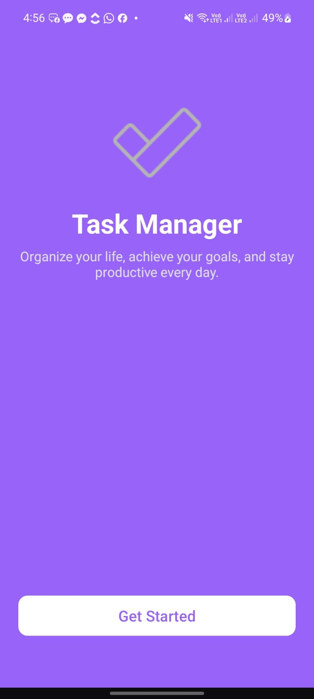
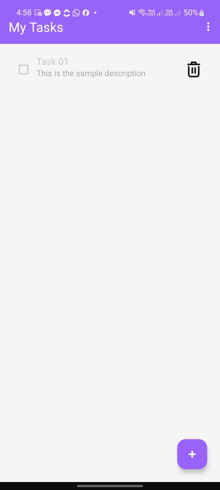
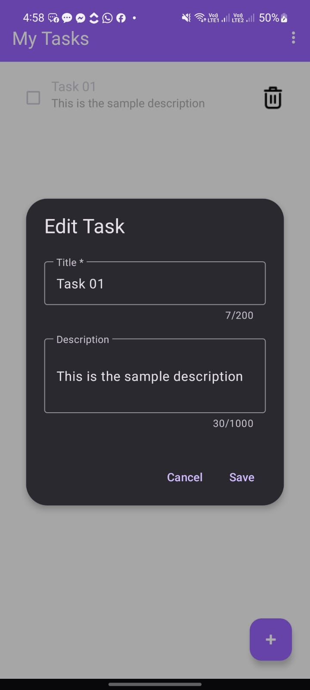
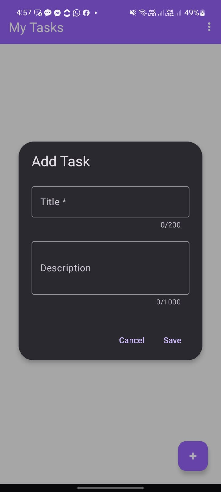

# Task Manager App

Mobile Application Development - Continuous Assessment 03  
**Student No:** 14612

## 📱 Project Overview

Task Manager is an Android application designed to help users efficiently organize and manage their daily tasks. Built with Kotlin and following modern Android development practices, this app provides a clean and intuitive interface for creating, tracking, and completing tasks.

## ✨ Features

- **Task Management**: Create, view, and manage tasks with titles and descriptions
- **Task Status**: Mark tasks as completed or pending
- **Persistent Storage**: Tasks are saved locally and persist across app sessions
- **Navigation**: Smooth navigation between start screen and task list
- **Modern UI**: Clean Material Design interface with responsive layouts
- **MVVM Architecture**: Implements ViewModel pattern for better code organization and lifecycle management

## 🛠️ Technical Details

- **Language**: Kotlin
- **Minimum SDK**: API 28 (Android 9.0)
- **Target SDK**: API 36
- **Architecture**: MVVM (Model-View-ViewModel)
- **UI Components**: Navigation Components, RecyclerView, ViewBinding
- **Data Persistence**: Local storage implementation

## 📂 Project Structure

```
app/src/main/java/com/example/taskmanager/
├── MainActivity.kt          # Main activity with navigation setup
├── Task.kt                  # Task data model
├── TaskViewModel.kt         # ViewModel for task management
├── TaskAdapter.kt           # RecyclerView adapter for task list
├── TaskStorage.kt           # Local storage handler
├── FirstFragment.kt         # Start/Welcome screen
└── SecondFragment.kt        # Task list screen
```

## 🚀 Getting Started

1. Clone the repository
2. Open the project in Android Studio
3. Sync Gradle files
4. Run the app on an emulator or physical device (Android 9.0+)

## 📝 Usage

- Launch the app to see the welcome screen
- Navigate to the task list to view all tasks
- Add new tasks with title and description
- Mark tasks as completed by tapping on them
- Tasks are automatically saved and will be available when you reopen the app

## 📸 Screenshots

<table>
  <tr>
    <td></td>
    <td></td>
    <td></td>
    <td></td>
  </tr>
  <tr>
    <td align="center"><b>Welcome Screen</b></td>
    <td align="center"><b>Task List</b></td>
    <td align="center"><b>Edit Task</b></td>
    <td align="center"><b>Add Task</b></td>
  </tr>
</table>

## 🎨 Design Choices

### Color Scheme
- **Primary Color**: Purple gradient background creates a modern and calming aesthetic
- **Accent Colors**: White text and UI elements provide excellent contrast and readability
- The purple theme conveys creativity and productivity, aligning with the app's purpose

### User Interface
- **Welcome Screen**: Features a large checkmark icon symbolizing task completion, with a motivational tagline to engage users immediately
- **Clean Layout**: Minimalist design reduces cognitive load and helps users focus on their tasks
- **Material Design**: Follows Google's Material Design guidelines for familiarity and consistency

### User Experience
- **Dialog-based Task Entry**: Modal dialogs for adding and editing tasks keep users focused on the current action
- **Character Limits**: Title limited to 200 characters and description to 1000 characters ensures concise task management
- **Checkbox Interaction**: Visual feedback when marking tasks as complete provides instant satisfaction
- **Delete Icon**: Easily accessible trash icon for quick task removal
- **Floating Action Button (FAB)**: Purple FAB in the bottom-right corner follows Android conventions for primary actions

### Typography
- **Bold Headers**: "Task Manager" and "My Tasks" use prominent typography for clear hierarchy
- **Readable Font Sizes**: Ensures accessibility across different screen sizes and user preferences

### Navigation
- **Progressive Disclosure**: Welcome screen introduces the app before showing the task list
- **Hidden Top Bar on Start**: Action bar is hidden on the welcome screen for an immersive first impression
- **Consistent Navigation**: Standard Android navigation patterns make the app intuitive for all users
